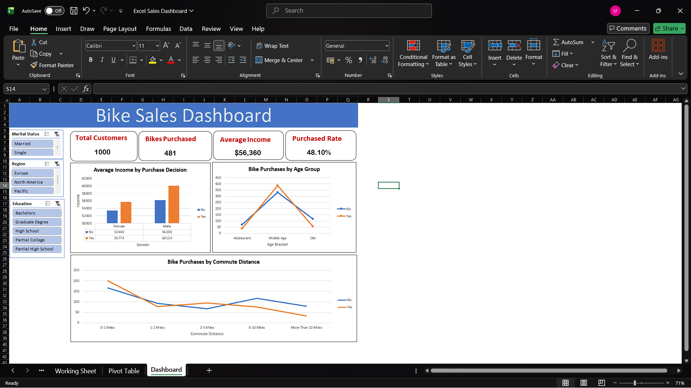

# Excel-Sales-Dashboard
Interactive Sales Dashboard built using Microsoft Excel for data analysis and business insights.
# 📊 Excel Sales Dashboard

## Project Overview

This project is an interactive Sales Dashboard created using Microsoft Excel.

The dashboard helps analyze:

- Total Sales
- Total Profit
- Regional Performance
- Monthly Sales Trends
- Product Performance

---

## Tools Used

- Microsoft Excel
- Pivot Tables
- Pivot Charts
- Slicers
- Conditional Formatting
- Excel Formulas

---

## Dashboard Preview

---

## Business Problem

Businesses generate thousands of sales records every month.

This dashboard helps decision-makers quickly monitor performance and identify trends.

---

## Key Insights

- Highest Sales Region
- Best Selling Products
- Monthly Growth Trend
- Profit Analysis

---

## Skills Demonstrated

- Data Cleaning
- Data Visualization
- Dashboard Design
- KPI Reporting
- Excel Analytics

---

## Files Included

- Excel Sales Dashboard.xlsx
- dashboard.png
- Dataset.csv
